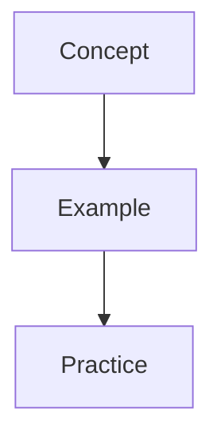

# Markdown Authoring README for Club 360 Pro

This is the practical guide for creating content in this site.

It covers the blocks you can use when writing:

- technical posts
- club lessons
- beginner coaching content
- math notes
- university explanations
- board-based teaching posts
- Game training questions

## Where To Create Posts

Create posts here:

```text
src/_posts/en/
src/_posts/pt/
src/_posts/[language-code]/
```

You can use either:

- `.md`
- `.mdx`

In this project, both work with the MDX pipeline, so you can use JSX-style components like `BoardFigure` inside your post files.

## Basic Post Template

```md
---
title: "My Post Title"
description: "Short description of the article."
date: 2026-05-03
translationKey: my-post-title
categories: ["Teaching", "Coaching"]
tags: ["demo", "beginner-friendly"]
collaborators:
  - name: "Your Name"
    src: "https://avatars.githubusercontent.com/u/YOUR_ID"
---

# My Post Title

Intro paragraph here.

## First section

Content here.
```

If the markdown H1 matches the frontmatter title, the site automatically removes the duplicated in-article title on the rendered page.

## Cover Images

Use this frontmatter shape:

```yaml
image:
  path: /images/covers/my-cover.webp
  alt: "Describe the image"
  width: 1200
  height: 630
  lqip: data:image/webp;base64,...
```

For the full image workflow, read:

- [fast-image.md](fast-image.md)

## Prompt Callouts

### Tip

```md
> Start with what the learner already understands.
{: .prompt-tip}
```

### Info

```md
> Repeat important ideas in both image and text form.
{: .prompt-info}
```

### Warning

```md
> Too much information in one board can slow learning down.
{: .prompt-warning}
```

### Danger

```md
> Never share private student information in screenshots or board photos.
{: .prompt-danger}
```

## Mermaid Graphs

Use fenced code blocks:

````md

````

Good for:

- lesson flow
- decision logic
- system design
- study plans

## YouTube Embeds

Use the Chirpy-style syntax:

```md

```

Replace the id with your own video id.

## Normal Markdown Images

Use normal markdown:

```md

```

That renders with the article image frame and opens in a full-size tab when clicked.

## `BoardFigure`

Use this for one main teaching image:

```mdx
<BoardFigure
  src="/images/boards/logic-variables.webp"
  alt="Whiteboard explanation of int, string, float, and boolean"
  caption="Programming basics explained on the board"
  focus="Coaching board"
  note="This board was used before the code example so the learner could understand the concept visually first."
  width={1600}
  height={1000}
/>
```

Best for:

- one board image
- one handwritten note
- one Canva teaching illustration
- one math explanation visual

## `BoardSteps`

Use this when the explanation needs progression:

```mdx
<BoardSteps
  title="How I explained the idea step by step"
  summary="Breaking a lesson into stages helps the learner focus on one concept at a time."
>
  <BoardFigure
    src="/images/boards/step-1.webp"
    alt="Step 1 board"
    caption="Step 1: Define the idea"
    focus="Step 1"
    width={1600}
    height={1000}
  />

  <BoardFigure
    src="/images/boards/step-2.webp"
    alt="Step 2 board"
    caption="Step 2: Show the example"
    focus="Step 2"
    width={1600}
    height={1000}
  />
</BoardSteps>
```

For more board-specific ideas, read:

- [board-content.md](board-content.md)

## `quiz` Blocks for Game Training

Use a fenced `quiz` block when an article should also create practice questions for the Game page.

````md
```quiz
{
  "id": "binary-1011-decimal",
  "question": "What is 1011_2 in decimal?",
  "image": "/images/boards/binario-para-decimal-step-4.svg",
  "options": ["9_10", "10_10", "11_10", "13_10"],
  "answer": 2,
  "explanation": "1011_2 = 1x8 + 0x4 + 1x2 + 1x1 = 11_10.",
  "tags": ["binary", "conversion"],
  "timeLimit": 35
}
```
````

Important details:

- `question`, `options`, and `answer` are required.
- `options` needs at least two choices.
- `answer` is zero-based, so `0` is the first option.
- `timeLimit` is in seconds. If omitted, the default is `30`.
- `image` should point to a file inside `public/`, such as `/images/boards/example.svg`.

One post with valid `quiz` blocks becomes one Game training set automatically. The training title and description come from the post frontmatter.

For the complete workflow, read:

- [game-quiz.md](game-quiz.md)

## Code Blocks

Use fenced blocks with a language:

````md
```python
age = 18
print(type(age))
```
````

## Tables

```md
| Type | Example |
| --- | --- |
| int | 18 |
| string | "Rubens" |
| boolean | true |
```

## Details / Expandable Content

```mdx
<details>
  <summary>Show the explanation</summary>
  <p>Put the hidden explanation here.</p>
</details>
```

## Suggested Structure For Beginner Content

This is a strong structure for your site:

```md
## What we learned

Short summary in simple language.

## Board explanation

Use BoardFigure or a markdown image.

## Clean explanation

Explain the same idea with simple text.

## Small example

Show one small code or math example.

## Exercise

Ask the learner to predict or solve something.

## Key takeaway

End with one sentence worth remembering.
```

## Recommended Image Folders

```text
public/images/covers/
public/images/boards/
public/images/math/
public/images/club/
```

## Final Advice

- One post should teach one main idea well.
- A board is strongest when it supports the explanation, not replaces it.
- If the image is dense, split it into steps.
- If the learner is a beginner, clarity is more important than complexity.
