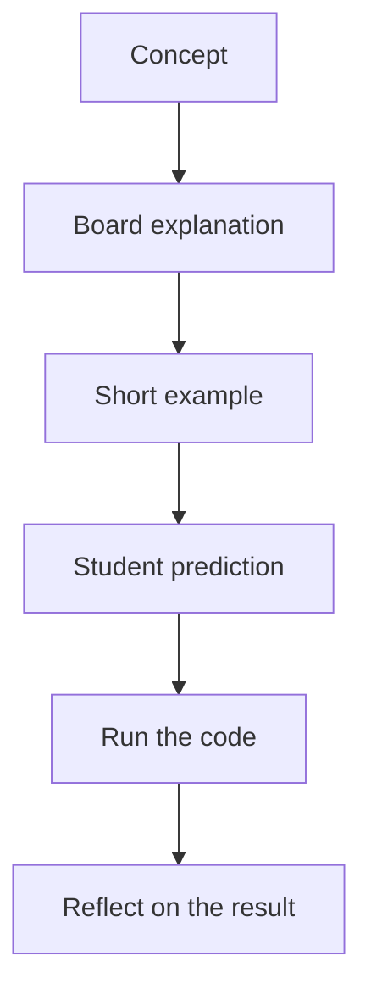

# Teaching Content Demo for Boards, Tips, Graphs, and Video

This post exists to test the teaching-friendly content blocks in Club 360 Pro.

It is written the same way you could write a real club lesson, beginner coaching article, or university explanation when you want people to understand your ideas faster.

> Start with the learner's current mental model, not the most advanced version of the topic.
{: .prompt-tip}

## What this demo is testing

This article includes:

- prompt callouts
- a board-style teaching image
- a step-by-step board sequence
- a mermaid graph
- code blocks
- a table
- a YouTube embed
- a regular markdown image
- a simple lesson structure

## Board explanation

<BoardFigure
  src="/images/boards/logic-board-demo-1.svg"
  alt="Whiteboard-style explanation of variables and basic programming types like int, string, float, and boolean"
  caption="Programming basics explained in a way that a beginner can scan quickly"
  focus="Coaching board"
  note="This kind of board works well when you want the learner to connect each type to one concrete example before going into deeper syntax."
  width={1600}
  height={1000}
  priority
/>

The board gives the reader an immediate mental picture. Even before they read every sentence, they can already see that:

- each type has a name
- each type has an example
- the lesson is concrete, not abstract

## Clean explanation after the board

If you are teaching a beginner, the board should not be the only explanation. The text should restate the idea in a calmer and more linear way.

For example:

- `int` usually represents whole numbers
- `string` represents text
- `float` represents decimal numbers
- `boolean` represents `true` or `false`

> If the image gives intuition, the text should give certainty.
{: .prompt-info}

## A simple graph for the lesson flow



Mermaid is useful when the lesson has a sequence, decision path, or process to visualize.

## Small code example

```python
age = 18
name = "Rubens"
price = 10.5
is_ready = True

print(type(age))
print(type(name))
print(type(price))
print(type(is_ready))
```

When coaching, a small example is usually better than a large example. A learner should be able to predict the output before running the code.

## Step-by-step board sequence

<BoardSteps
  title="One idea shown in progression"
  summary="When a topic feels heavy, break it into small visual steps so the learner does not need to understand everything at once."
>
  <BoardFigure
    src="/images/boards/logic-board-demo-1.svg"
    alt="Board introducing variables and their basic types"
    caption="Step 1: Give names to the building blocks"
    focus="Step 1"
    note="The learner first needs vocabulary."
    width={1600}
    height={1000}
  />

  <BoardFigure
    src="/images/boards/logic-board-demo-2.svg"
    alt="Board showing boolean logic with true and false examples"
    caption="Step 2: Show how conditions return true or false"
    focus="Step 2"
    note="Now the learner sees what a check or comparison means."
    width={1600}
    height={1000}
  />

  <BoardFigure
    src="/images/boards/logic-board-demo-3.svg"
    alt="Board showing a teaching flow from concept to example to exercise"
    caption="Step 3: Move from explanation to action"
    focus="Step 3"
    note="A concept becomes stronger when the learner predicts, answers, or practices."
    width={1600}
    height={1000}
  />
</BoardSteps>

## A quick comparison table

| Teaching move | Why it helps beginners |
| --- | --- |
| Use one board per idea | Reduces overload |
| Show one code block at a time | Keeps attention on the concept |
| Ask for a prediction | Turns passive reading into thinking |
| Repeat the idea in text | Helps the learner confirm meaning |

## A regular markdown image


You can still use normal markdown images when you do not need the richer `BoardFigure` treatment.

## Video embed example

If you later record club lessons or beginner explanations, you can embed the video directly in the article:



You can replace that id with your own lesson recording or explanation video.

## A warning for teaching content

> Do not confuse visual density with teaching quality. A crowded board can impress people without helping them learn.
{: .prompt-warning}

## A simple exercise block

Try this with your students or readers:

1. Show the board first.
2. Ask what each variable means.
3. Ask which expressions become `true` or `false`.
4. Ask them to predict the result before running code.
5. Only then show the answer.

<details>
  <summary>Why this sequence works</summary>
  <p>It gives the learner time to think before you reveal the result. That changes the lesson from passive reading into active reasoning.</p>
</details>

## Key takeaway

Your content becomes easier when each post does three things well:

- show the idea visually
- explain it simply in text
- give the learner one small action to take

That is the kind of structure that can help beginners, club members, and coached students understand your work much faster.
