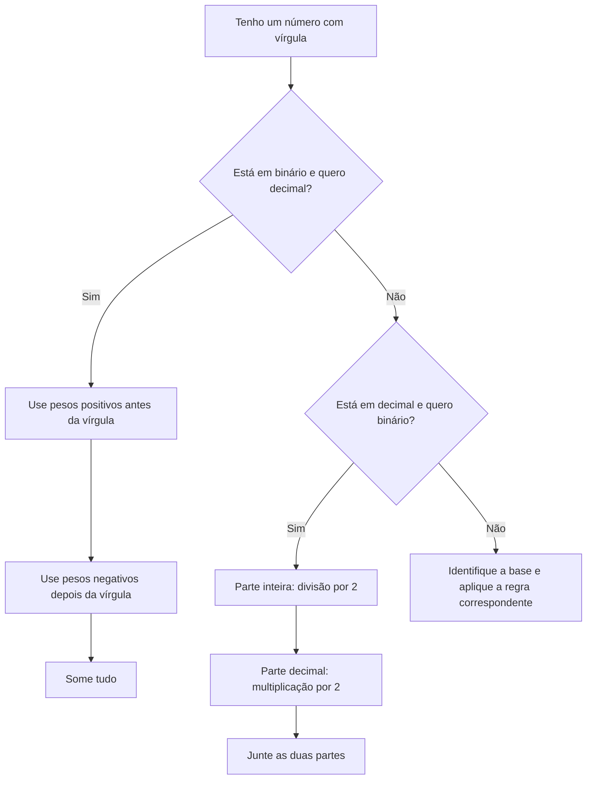

# Sistema de Numeração com Vírgula e Operações em Bases Diferentes

Na primeira parte, aprendemos a converter números inteiros entre bases.

Agora vamos avançar um pouco mais.

Nesta aula, vamos aprender:

- converter binário com vírgula para decimal
- converter decimal com vírgula para binário
- fazer multiplicação e divisão em binário
- fazer soma e subtração em hexadecimal
- fazer soma e subtração em octal
- treinar com perguntas reutilizáveis no **Club360 Game**

> Quando aparece vírgula em sistema de numeração, a lógica continua a mesma: cada posição tem um peso.
{: .prompt-tip}

---

## Antes de começar: o que muda quando aparece vírgula?

Em números inteiros, os pesos crescem para a esquerda.

No binário, por exemplo:

```text
2³, 2², 2¹, 2⁰
```

Mas depois da vírgula, os pesos ficam negativos:

```text
2⁻¹, 2⁻², 2⁻³, 2⁻⁴...
```

Isso significa que depois da vírgula os valores ficam menores.

| Casa depois da vírgula | Potência | Valor decimal |
| ---: | ---: | ---: |
| 1ª casa | 2⁻¹ | 0,5 |
| 2ª casa | 2⁻² | 0,25 |
| 3ª casa | 2⁻³ | 0,125 |
| 4ª casa | 2⁻⁴ | 0,0625 |

> Antes da vírgula, os pesos crescem. Depois da vírgula, os pesos diminuem.
{: .prompt-info}

---

## Ilustração 1: Pesos antes e depois da vírgula


<BoardFigure
  src="/images/boards/pesos-binarios-com-virgula.svg"
  alt="Board mostrando os pesos de um número binário com vírgula"
  caption="Depois da vírgula, usamos potências negativas da base."
  focus="Pesos com vírgula"
  note="Esse conceito ajuda o aluno a entender números fracionários em binário."
  width={1600}
  height={1000}
  priority
/>

---

## 1. Q2: Converter `10,101₂` para decimal com 4 casas

Temos o número:

```text
10,101₂
```

A base é 2.

Vamos separar em duas partes:

```text
10,101₂ = 10₂ + 0,101₂
```

Parte inteira:

```text
10₂
```

Parte fracionária:

```text
0,101₂
```

---

### 1.1 Parte inteira

A parte inteira é:

```text
10₂
```

Colocando os pesos:

```text
1    0
2¹   2⁰
```

Agora calculamos:

```text
1×2¹ + 0×2⁰
```

```text
1×2 + 0×1 = 2
```

Então:

```text
10₂ = 2₁₀
```

---

### 1.2 Parte depois da vírgula

Agora pegamos:

```text
0,101₂
```

Colocando os pesos depois da vírgula:

```text
1      0      1
2⁻¹    2⁻²    2⁻³
```

Sabendo que:

```text
2⁻¹ = 0,5
2⁻² = 0,25
2⁻³ = 0,125
```

Agora multiplicamos:

```text
1×0,5 + 0×0,25 + 1×0,125
```

```text
0,5 + 0 + 0,125 = 0,625
```

---

### 1.3 Juntando tudo

Parte inteira:

```text
2
```

Parte fracionária:

```text
0,625
```

Resultado:

```text
2 + 0,625 = 2,625
```

Com 4 casas de precisão:

```text
10,101₂ = 2,6250₁₀
```

---

## BoardSteps: Q2 passo a passo


<BoardSteps
  title="Q2: Convertendo 10,101₂ para decimal"
  summary="Separamos a parte inteira da parte fracionária e somamos os pesos."
>
  <BoardFigure
    src="/images/boards/q2-binario-decimal-step-1.svg"
    alt="Step 1 separando parte inteira e fracionária do número 10,101 em binário"
    caption="Step 1: Separe a parte inteira da parte depois da vírgula."
    focus="Separação"
    note="A parte inteira e a parte fracionária usam pesos diferentes."
    width={1600}
    height={1000}
  />

  <BoardFigure
    src="/images/boards/q2-binario-decimal-step-2.svg"
    alt="Step 2 calculando a parte inteira 10 em binário"
    caption="Step 2: Resolva a parte inteira."
    focus="Parte inteira"
    note="10₂ vale 2₁₀."
    width={1600}
    height={1000}
  />

  <BoardFigure
    src="/images/boards/q2-binario-decimal-step-3.svg"
    alt="Step 3 calculando a parte fracionária 101 em binário"
    caption="Step 3: Resolva a parte fracionária com potências negativas."
    focus="Parte fracionária"
    note="Depois da vírgula usamos 2⁻¹, 2⁻², 2⁻³..."
    width={1600}
    height={1000}
  />

  <BoardFigure
    src="/images/boards/q2-binario-decimal-step-4.svg"
    alt="Step 4 mostrando a resposta 2,6250 em decimal"
    caption="Step 4: Some tudo e escreva com 4 casas."
    focus="Resposta"
    note="10,101₂ = 2,6250₁₀."
    width={1600}
    height={1000}
  />
</BoardSteps>

---

## 2. Q3: Converter `7,32₁₀` para binário com 4 casas

Agora temos o número decimal:

```text
7,32₁₀
```

Queremos transformar em binário com 4 casas depois da vírgula.

Vamos separar:

```text
7,32 = 7 + 0,32
```

Parte inteira:

```text
7
```

Parte decimal:

```text
0,32
```

---

### 2.1 Parte inteira: `7₁₀` para binário

Fazemos divisão por 2:

```text
7 ÷ 2 = 3 resto 1
3 ÷ 2 = 1 resto 1
1 ÷ 2 = 0 resto 1
```

Lendo os restos de baixo para cima:

```text
111₂
```

Então:

```text
7₁₀ = 111₂
```

---

### 2.2 Parte decimal: `0,32` para binário

Para converter a parte decimal, usamos outro método:

```text
multiplicar por 2
pegar a parte inteira
repetir até ter a quantidade de casas pedida
```

Como a questão pede 4 casas, fazemos 4 multiplicações:

```text
0,32 × 2 = 0,64  -> pega 0
0,64 × 2 = 1,28  -> pega 1
0,28 × 2 = 0,56  -> pega 0
0,56 × 2 = 1,12  -> pega 1
```

Os bits depois da vírgula são:

```text
0101
```

Então:

```text
0,32₁₀ ≈ 0,0101₂
```

---

### 2.3 Juntando tudo

Parte inteira:

```text
7₁₀ = 111₂
```

Parte decimal:

```text
0,32₁₀ ≈ 0,0101₂
```

Resultado:

```text
7,32₁₀ ≈ 111,0101₂
```

Resposta:

```text
7,32₁₀ ≈ 111,0101₂
```

com 4 casas de precisão.

> Quando a parte decimal não termina exatamente, usamos a quantidade de casas pedida pela questão.
{: .prompt-warning}

---

## BoardSteps: Q3 passo a passo


<BoardSteps
  title="Q3: Convertendo 7,32₁₀ para binário"
  summary="A parte inteira usa divisão por 2. A parte decimal usa multiplicação por 2."
>
  <BoardFigure
    src="/images/boards/q3-decimal-binario-step-1.svg"
    alt="Step 1 separando 7,32 em parte inteira e parte decimal"
    caption="Step 1: Separe o número em parte inteira e parte decimal."
    focus="Separação"
    note="7,32 vira 7 + 0,32."
    width={1600}
    height={1000}
  />

  <BoardFigure
    src="/images/boards/q3-decimal-binario-step-2.svg"
    alt="Step 2 convertendo 7 decimal para 111 binário"
    caption="Step 2: Converta a parte inteira com divisão por 2."
    focus="Parte inteira"
    note="7₁₀ = 111₂."
    width={1600}
    height={1000}
  />

  <BoardFigure
    src="/images/boards/q3-decimal-binario-step-3.svg"
    alt="Step 3 convertendo 0,32 decimal para binário com multiplicações por 2"
    caption="Step 3: Converta a parte decimal multiplicando por 2."
    focus="Parte decimal"
    note="Cada parte inteira encontrada vira uma casa depois da vírgula."
    width={1600}
    height={1000}
  />

  <BoardFigure
    src="/images/boards/q3-decimal-binario-step-4.svg"
    alt="Step 4 mostrando a resposta 111,0101 em binário"
    caption="Step 4: Junte a parte inteira com a parte fracionária."
    focus="Resposta"
    note="7,32₁₀ ≈ 111,0101₂."
    width={1600}
    height={1000}
  />
</BoardSteps>

---

## 3. Como escolher o método certo?

Use este mapa:



> O segredo é separar a parte inteira da parte depois da vírgula.
{: .prompt-tip}

---

## 4. Q4: Operações usando a base dos números

Agora vamos fazer contas respeitando a base em que os números estão.

A questão pede:

```text
Realize os cálculos e dê o resultado usando a base numérica em que os números estão representados.
```

Ou seja:

- se os números estão em binário, a resposta fica em binário
- se estão em hexadecimal, a resposta fica em hexadecimal
- se estão em octal, a resposta fica em octal

---

## 5. Q4 a) `100101₂ × 100₂`

Conta:

```text
100101₂ × 100₂
```

Aqui existe um macete importante.

No binário:

```text
100₂ = 4₁₀
```

Multiplicar por `100₂` é o mesmo que deslocar o número duas casas para a esquerda.

Então:

```text
100101₂ × 100₂ = 10010100₂
```

Resposta:

```text
10010100₂
```

> Em binário, multiplicar por 10₂ desloca uma casa. Multiplicar por 100₂ desloca duas casas.
{: .prompt-tip}

---

## Ilustração 2: Multiplicação binária por deslocamento


<BoardFigure
  src="/images/boards/q4a-multiplicacao-binaria-deslocamento.svg"
  alt="Board mostrando multiplicação binária por 100 com deslocamento de duas casas"
  caption="Multiplicar por 100₂ desloca o número duas casas para a esquerda."
  focus="Multiplicação binária"
  note="Esse macete deixa a multiplicação mais rápida."
  width={1600}
  height={1000}
/>

---

## 6. Q4 b) `100101₂ ÷ 1011₂`

Conta:

```text
100101₂ ÷ 1011₂
```

Vamos converter para decimal apenas para entender o valor:

```text
100101₂ = 37₁₀
1011₂ = 11₁₀
```

Então:

```text
37 ÷ 11 = 3,3636...
```

A parte inteira é:

```text
3₁₀ = 11₂
```

Agora precisamos de 2 casas depois da vírgula.

A parte decimal é aproximadamente:

```text
0,3636...
```

Convertendo para binário:

```text
0,3636 × 2 = 0,7272  -> pega 0
0,7272 × 2 = 1,4544  -> pega 1
```

Com duas casas:

```text
,01
```

Resposta com 2 casas:

```text
100101₂ ÷ 1011₂ ≈ 11,01₂
```

> Aqui usamos aproximação porque a divisão não termina exatamente.
{: .prompt-warning}

---

## Ilustração 3: Divisão binária com duas casas


<BoardFigure
  src="/images/boards/q4b-divisao-binaria-duas-casas.svg"
  alt="Board mostrando divisão binária com duas casas de precisão"
  caption="Na divisão, podemos usar aproximação com a quantidade de casas pedida."
  focus="Divisão binária"
  note="Aqui usamos duas casas depois da vírgula porque a questão pediu."
  width={1600}
  height={1000}
/>

---

## 7. Q4 c) `DE2₁₆ + 32₁₆`

Conta:

```text
DE2₁₆ + 32₁₆
```

Vamos alinhar os números:

```text
  DE2
+ 032
-----
```

Agora somamos da direita para a esquerda.

Primeira coluna:

```text
2 + 2 = 4
```

Segunda coluna:

```text
E + 3
```

No hexadecimal:

```text
E = 14
```

Então:

```text
14 + 3 = 17
```

Em hexadecimal, 17 decimal é:

```text
11₁₆
```

Então colocamos `1` e vai `1` para a próxima coluna.

Última coluna:

```text
D + 1 = E
```

Resultado:

```text
  DE2
+ 032
-----
  E14
```

Resposta:

```text
DE2₁₆ + 32₁₆ = E14₁₆
```

---

## 8. Q4 d) `10₁₆ - A₁₆`

Conta:

```text
10₁₆ - A₁₆
```

Lembre:

```text
10₁₆ = 16₁₀
A₁₆ = 10₁₀
```

Então:

```text
16 - 10 = 6
```

Resposta:

```text
10₁₆ - A₁₆ = 6₁₆
```

---

## Ilustração 4: Soma e subtração hexadecimal


<BoardFigure
  src="/images/boards/q4c-q4d-hexadecimal-operacoes.svg"
  alt="Board explicando soma e subtração em hexadecimal"
  caption="No hexadecimal, as letras representam valores de 10 até 15."
  focus="Operações em hexadecimal"
  note="A tabela A até F ajuda a evitar erro nas operações."
  width={1600}
  height={1000}
/>

---

## 9. Q4 e) `705₈ + 123₈`

Conta:

```text
705₈ + 123₈
```

Vamos alinhar:

```text
  705
+ 123
-----
```

Somando da direita para a esquerda:

Primeira coluna:

```text
5 + 3 = 8
```

Mas em base 8, o número 8 não aparece como algarismo.

Em octal:

```text
8₁₀ = 10₈
```

Então colocamos `0` e sobe `1`.

Segunda coluna:

```text
0 + 2 + 1 = 3
```

Terceira coluna:

```text
7 + 1 = 8
```

De novo:

```text
8₁₀ = 10₈
```

Então colocamos `0` e sobe `1`.

Resultado:

```text
  705
+ 123
-----
 1030
```

Resposta:

```text
705₈ + 123₈ = 1030₈
```

---

## 10. Q4 f) `65₈ - 47₈`

Conta:

```text
65₈ - 47₈
```

Montando:

```text
  65
- 47
----
```

Na primeira coluna:

```text
5 - 7
```

Não dá, então precisamos pegar emprestado.

Como estamos em base 8, pegar emprestado significa adicionar 8 à casa atual.

O `5` vira:

```text
5 + 8 = 13₁₀
```

Em octal, podemos pensar como:

```text
15₈
```

Agora:

```text
15₈ - 7₈ = 6₈
```

A casa da esquerda, que era `6`, emprestou 1 e virou `5`.

Agora:

```text
5 - 4 = 1
```

Resultado:

```text
  65
- 47
----
  16
```

Resposta:

```text
65₈ - 47₈ = 16₈
```

---

## Ilustração 5: Soma e subtração em octal


<BoardFigure
  src="/images/boards/q4e-q4f-octal-operacoes.svg"
  alt="Board mostrando soma e subtração em octal com transporte e empréstimo"
  caption="No octal, quando passa de 7, viramos a casa."
  focus="Operações em octal"
  note="O transporte e o empréstimo seguem a base 8, não a base 10."
  width={1600}
  height={1000}
/>

---

## 11. Resumo das respostas

```text
Q2) 10,101₂ = 2,6250₁₀

Q3) 7,32₁₀ ≈ 111,0101₂

Q4)
a) 100101₂ × 100₂ = 10010100₂
b) 100101₂ ÷ 1011₂ ≈ 11,01₂
c) DE2₁₆ + 32₁₆ = E14₁₆
d) 10₁₆ - A₁₆ = 6₁₆
e) 705₈ + 123₈ = 1030₈
f) 65₈ - 47₈ = 16₈
```

---

## 12. Macetes finais

### Para binário com vírgula virar decimal

Use potências negativas depois da vírgula:

```text
2⁻¹ = 0,5
2⁻² = 0,25
2⁻³ = 0,125
2⁻⁴ = 0,0625
```

---

### Para decimal com vírgula virar binário

Separe o número:

```text
parte inteira + parte decimal
```

Parte inteira:

```text
divide por 2
```

Parte decimal:

```text
multiplica por 2
pega a parte inteira
repete até ter a quantidade de casas pedida
```

---

### Para operações em outras bases

Sempre lembre:

```text
Binário: só vai até 1
Octal: só vai até 7
Hexadecimal: vai até F
```

No hexadecimal:

```text
A = 10
B = 11
C = 12
D = 13
E = 14
F = 15
```

---

## Treino rápido no Club360 Game

As perguntas abaixo também alimentam a página **Game** do Club360.

O aluno pode entrar no treino, responder com tempo, ver o resultado e tentar de novo sem precisar copiar nada para outro lugar.


```quiz
{
  "id": "binario-virgula-pesos-negativos",
  "question": "Depois da vírgula em um número binário, quais potências usamos?",
  "image": "/images/boards/pesos-binarios-com-virgula.svg",
  "options": ["Potências positivas", "Potências negativas", "Apenas potência zero", "Potências de 10"],
  "answer": 1,
  "explanation": "Depois da vírgula usamos potências negativas, como 2⁻¹, 2⁻² e 2⁻³.",
  "tags": ["binário", "vírgula", "potências negativas", "iniciante"],
  "timeLimit": 25
}
```

```quiz
{
  "id": "binario-10-101-decimal",
  "question": "Quanto vale 10,101₂ em decimal com 4 casas?",
  "image": "/images/boards/q2-binario-decimal-step-4.svg",
  "options": ["2,5000₁₀", "2,6250₁₀", "2,7500₁₀", "3,1250₁₀"],
  "answer": 1,
  "explanation": "10₂ vale 2. A parte 0,101₂ vale 0,625. Então o resultado é 2,6250₁₀.",
  "tags": ["binário", "decimal", "números fracionários"],
  "timeLimit": 45
}
```

```quiz
{
  "id": "decimal-virgula-para-binario-metodo",
  "question": "Para converter a parte decimal de um número para binário, qual método usamos?",
  "image": "/images/boards/q3-decimal-binario-step-3.svg",
  "options": ["Dividir por 2", "Multiplicar por 2", "Somar os dígitos", "Trocar por hexadecimal"],
  "answer": 1,
  "explanation": "A parte inteira usa divisão por 2. A parte decimal usa multiplicação por 2.",
  "tags": ["decimal para binário", "vírgula", "multiplicação por 2"],
  "timeLimit": 30
}
```

```quiz
{
  "id": "decimal-7-32-binario",
  "question": "Com 4 casas depois da vírgula, 7,32₁₀ fica aproximadamente como em binário?",
  "image": "/images/boards/q3-decimal-binario-step-4.svg",
  "options": ["111,0101₂", "111,1010₂", "101,0101₂", "1000,0101₂"],
  "answer": 0,
  "explanation": "A parte inteira 7 vira 111₂. A parte decimal 0,32 gera 0101 com 4 casas. Resultado: 111,0101₂.",
  "tags": ["decimal", "binário", "números fracionários"],
  "timeLimit": 50
}
```

```quiz
{
  "id": "multiplicacao-binaria-deslocamento",
  "question": "Em binário, multiplicar por 100₂ causa qual efeito?",
  "image": "/images/boards/q4a-multiplicacao-binaria-deslocamento.svg",
  "options": ["Remove dois bits", "Desloca duas casas para a esquerda", "Divide por 4", "Troca para octal"],
  "answer": 1,
  "explanation": "100₂ vale 4₁₀. Multiplicar por 100₂ desloca o número duas casas para a esquerda.",
  "tags": ["binário", "multiplicação", "deslocamento"],
  "timeLimit": 30
}
```

```quiz
{
  "id": "q4a-resultado-binario",
  "question": "Qual é o resultado de 100101₂ × 100₂?",
  "image": "/images/boards/q4a-multiplicacao-binaria-deslocamento.svg",
  "options": ["1001010₂", "10010100₂", "100100₂", "10100100₂"],
  "answer": 1,
  "explanation": "Multiplicar por 100₂ desloca duas casas para a esquerda. Então 100101₂ vira 10010100₂.",
  "tags": ["binário", "multiplicação"],
  "timeLimit": 35
}
```

```quiz
{
  "id": "q4b-divisao-binaria",
  "question": "Com 2 casas de precisão, qual é o resultado aproximado de 100101₂ ÷ 1011₂?",
  "image": "/images/boards/q4b-divisao-binaria-duas-casas.svg",
  "options": ["10,01₂", "11,01₂", "11,10₂", "100,01₂"],
  "answer": 1,
  "explanation": "100101₂ = 37₁₀ e 1011₂ = 11₁₀. 37 ÷ 11 ≈ 3,36. Em binário, com 2 casas, fica aproximadamente 11,01₂.",
  "tags": ["binário", "divisão", "aproximação"],
  "timeLimit": 55
}
```

```quiz
{
  "id": "hexadecimal-de2-mais-32",
  "question": "Qual é o resultado de DE2₁₆ + 32₁₆?",
  "image": "/images/boards/q4c-q4d-hexadecimal-operacoes.svg",
  "options": ["E14₁₆", "D14₁₆", "F14₁₆", "E04₁₆"],
  "answer": 0,
  "explanation": "DE2₁₆ + 032₁₆ = E14₁₆. Na coluna do meio, E + 3 gera transporte.",
  "tags": ["hexadecimal", "soma"],
  "timeLimit": 45
}
```

```quiz
{
  "id": "hexadecimal-10-menos-a",
  "question": "Qual é o resultado de 10₁₆ - A₁₆?",
  "image": "/images/boards/q4c-q4d-hexadecimal-operacoes.svg",
  "options": ["4₁₆", "5₁₆", "6₁₆", "A₁₆"],
  "answer": 2,
  "explanation": "10₁₆ vale 16₁₀. A₁₆ vale 10₁₀. Então 16 - 10 = 6.",
  "tags": ["hexadecimal", "subtração"],
  "timeLimit": 35
}
```

```quiz
{
  "id": "octal-705-mais-123",
  "question": "Qual é o resultado de 705₈ + 123₈?",
  "image": "/images/boards/q4e-q4f-octal-operacoes.svg",
  "options": ["1000₈", "1030₈", "1020₈", "830₈"],
  "answer": 1,
  "explanation": "Em octal, 5 + 3 = 8 vira 10₈. Depois 7 + 1 também gera transporte. Resultado: 1030₈.",
  "tags": ["octal", "soma"],
  "timeLimit": 45
}
```

```quiz
{
  "id": "octal-65-menos-47",
  "question": "Qual é o resultado de 65₈ - 47₈?",
  "image": "/images/boards/q4e-q4f-octal-operacoes.svg",
  "options": ["14₈", "15₈", "16₈", "20₈"],
  "answer": 2,
  "explanation": "Precisamos pegar emprestado em base 8. 15₈ - 7₈ = 6₈ e 5₈ - 4₈ = 1₈. Resultado: 16₈.",
  "tags": ["octal", "subtração", "empréstimo"],
  "timeLimit": 45
}
```

---

## 13. Exercícios para praticar

Agora tente resolver sozinho.

### Parte A: Binário com vírgula para decimal

```text
1) 1,1₂
2) 10,01₂
3) 11,101₂
4) 101,011₂
```

---

### Parte B: Decimal com vírgula para binário com 4 casas

```text
1) 2,5₁₀
2) 3,25₁₀
3) 4,75₁₀
4) 6,3₁₀
```

---

### Parte C: Operações em binário

```text
1) 101₂ × 10₂
2) 1101₂ × 100₂
3) 1010₂ ÷ 10₂
4) 1111₂ ÷ 11₂
```

---

### Parte D: Operações em hexadecimal

```text
1) A₁₆ + 5₁₆
2) 1F₁₆ + 1₁₆
3) 20₁₆ - A₁₆
4) FF₁₆ + 1₁₆
```

---

### Parte E: Operações em octal

```text
1) 7₈ + 1₈
2) 15₈ + 3₈
3) 20₈ - 7₈
4) 77₈ + 1₈
```

---

## 14. Gabarito

<details>
  <summary>Ver respostas dos exercícios</summary>

### Parte A: Binário com vírgula para decimal

```text
1) 1,1₂ = 1,5₁₀
2) 10,01₂ = 2,25₁₀
3) 11,101₂ = 3,625₁₀
4) 101,011₂ = 5,375₁₀
```

### Parte B: Decimal com vírgula para binário

```text
1) 2,5₁₀ = 10,1000₂
2) 3,25₁₀ = 11,0100₂
3) 4,75₁₀ = 100,1100₂
4) 6,3₁₀ ≈ 110,0100₂
```

### Parte C: Operações em binário

```text
1) 101₂ × 10₂ = 1010₂
2) 1101₂ × 100₂ = 110100₂
3) 1010₂ ÷ 10₂ = 101₂
4) 1111₂ ÷ 11₂ = 101₂
```

### Parte D: Operações em hexadecimal

```text
1) A₁₆ + 5₁₆ = F₁₆
2) 1F₁₆ + 1₁₆ = 20₁₆
3) 20₁₆ - A₁₆ = 16₁₆
4) FF₁₆ + 1₁₆ = 100₁₆
```

### Parte E: Operações em octal

```text
1) 7₈ + 1₈ = 10₈
2) 15₈ + 3₈ = 20₈
3) 20₈ - 7₈ = 11₈
4) 77₈ + 1₈ = 100₈
```

</details>

---

## Conclusão

Números com vírgula e operações em outras bases parecem difíceis no começo, mas seguem padrões simples.

Para lembrar:

```text
Binário com vírgula para decimal:
use pesos negativos depois da vírgula.
```

```text
Decimal com vírgula para binário:
parte inteira divide, parte decimal multiplica.
```

```text
Operações em bases diferentes:
respeite o limite da base.
```

Se você praticar com papel, lápis, setas e teste de mesa, vai perceber que a dificuldade diminui muito.

> O segredo não é decorar a resposta. O segredo é repetir o processo até ele ficar natural.
{: .prompt-tip}
