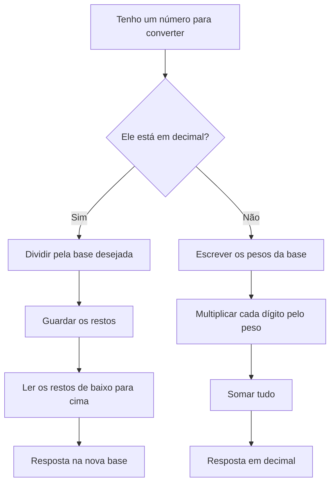

# Sistema de Numeração na Mão: Aprenda Binário, Octal e Hexadecimal sem Decorar

Muita gente trava quando vê números como `1011₂`, `347₈` ou `2A₁₆`.

Mas o segredo é simples:

> sistema de numeração não é sobre decorar tudo; é sobre entender o peso de cada posição.
{: .prompt-tip}

Neste artigo, você vai aprender com um estilo de **papel e lápis digital**:

- o que é uma base numérica
- como converter para decimal
- como converter decimal para outra base
- como usar teste de mesa
- como medir se você está evoluindo
- como praticar até ficar rápido

## Antes de começar: o que você precisa saber?

Você só precisa entender três ideias:

1. Cada sistema tem uma **base**.
2. Cada posição do número tem um **peso**.
3. Para converter, seguimos um **passo a passo**.

Nada de pressa. Vamos construir isso como se estivéssemos rabiscando no caderno.

## Ilustração 1: Capa visual da aula


<BoardFigure
  src="/images/boards/sistema-numeracao-na-mao-cover.svg"
  alt="Board com folha de caderno explicando que sistema de numeração usa base, peso, conta e resposta"
  caption="A ideia principal: cada número tem posições, e cada posição tem um peso."
  focus="Visão geral"
  note="Esse board deve dar ao aluno uma visão rápida antes de entrar nas contas."
  width={1600}
  height={1000}
  priority
/>

## 1. O que é sistema de numeração?

Um sistema de numeração é uma forma de representar números usando uma quantidade limitada de símbolos.

O sistema que usamos no dia a dia é o **decimal**, porque ele usa 10 símbolos:

```text
0, 1, 2, 3, 4, 5, 6, 7, 8, 9
```

Por isso chamamos de **base 10**.

Na computação, aparecem outros sistemas:

| Sistema | Base | Símbolos usados |
| --- | ---: | --- |
| Decimal | 10 | 0 até 9 |
| Binário | 2 | 0 e 1 |
| Octal | 8 | 0 até 7 |
| Hexadecimal | 16 | 0 até 9 e A até F |

> A base mostra quantos símbolos o sistema usa antes de “virar a casa”.
{: .prompt-info}

## Ilustração 2: Tabela das bases


<BoardFigure
  src="/images/boards/tabela-bases-numericas.svg"
  alt="Tabela visual mostrando decimal, binário, octal e hexadecimal com suas bases e símbolos"
  caption="Cada sistema tem uma base e uma lista de símbolos permitidos."
  focus="Bases numéricas"
  note="Esse board serve como uma cola rápida para o aluno consultar durante os exercícios."
  width={1600}
  height={1000}
/>

## 2. A ideia mais importante: posição tem peso

Observe este número decimal:

```text
253
```

Ele parece apenas “duzentos e cinquenta e três”, mas por trás dele existe uma lógica:

```text
2 centenas + 5 dezenas + 3 unidades
```

Ou seja:

```text
2 × 100 + 5 × 10 + 3 × 1
```

Agora pense assim:

```text
253 = 2×10² + 5×10¹ + 3×10⁰
```

Isso acontece porque o decimal usa base 10.

No binário, usamos base 2.

No octal, usamos base 8.

No hexadecimal, usamos base 16.

> O peso muda conforme a base muda.
{: .prompt-tip}

## Ilustração 3: Valor posicional


<BoardFigure
  src="/images/boards/valor-posicional-pesos.svg"
  alt="Board mostrando que cada posição de um número possui um peso dependendo da base"
  caption="Cada casa do número tem um peso. Esse peso depende da base."
  focus="Valor posicional"
  note="Esse é o conceito que destrava quase toda conversão de base."
  width={1600}
  height={1000}
/>

## 3. Regra 1: converter de qualquer base para decimal

Quando o número está em outra base e queremos transformar para decimal, usamos esta regra:

```text
dígito × peso da posição
```

Depois somamos tudo.

### Fórmula mental

```text
Base diferente -> Decimal
= multiplicar pelos pesos e somar
```

Exemplo:

```text
1011₂
```

Como é base 2, os pesos são potências de 2:

```text
2³, 2², 2¹, 2⁰
```

Agora montamos a conta:

```text
1    0    1    1
2³   2²   2¹   2⁰
```

Calculando os pesos:

```text
2³ = 8
2² = 4
2¹ = 2
2⁰ = 1
```

Agora multiplicamos:

```text
1×8 + 0×4 + 1×2 + 1×1
```

Resultado:

```text
8 + 0 + 2 + 1 = 11
```

Resposta:

```text
1011₂ = 11₁₀
```

## BoardSteps: Conversão de binário para decimal


<BoardSteps
  title="Convertendo 1011₂ para decimal"
  summary="Quebramos a conversão em pequenos passos para o aluno não se perder."
>
  <BoardFigure
    src="/images/boards/binario-para-decimal-step-1.svg"
    alt="Step 1 mostrando o número 1011 em base 2"
    caption="Step 1: Identifique o número e a base."
    focus="Número inicial"
    note="O número é 1011 e a base é 2."
    width={1600}
    height={1000}
  />

  <BoardFigure
    src="/images/boards/binario-para-decimal-step-2.svg"
    alt="Step 2 mostrando os pesos 2 elevado a 3, 2 elevado a 2, 2 elevado a 1 e 2 elevado a 0"
    caption="Step 2: Escreva os pesos da direita para a esquerda."
    focus="Pesos"
    note="A posição mais à direita sempre começa com potência zero."
    width={1600}
    height={1000}
  />

  <BoardFigure
    src="/images/boards/binario-para-decimal-step-3.svg"
    alt="Step 3 mostrando a multiplicação de cada dígito pelo seu peso"
    caption="Step 3: Multiplique cada dígito pelo peso da posição."
    focus="Multiplicação"
    note="O zero também participa da conta, mas ele zera aquela posição."
    width={1600}
    height={1000}
  />

  <BoardFigure
    src="/images/boards/binario-para-decimal-step-4.svg"
    alt="Step 4 mostrando a soma final igual a 11"
    caption="Step 4: Some tudo e encontre o valor decimal."
    focus="Resposta"
    note="1011₂ vale 11 no sistema decimal."
    width={1600}
    height={1000}
  />
</BoardSteps>

## 4. Teste de mesa para conversão de base

O teste de mesa é uma forma de organizar a conta no papel.

Para converter `1011₂` para decimal, você pode montar assim:

| Dígito | Peso | Conta | Resultado |
| ---: | ---: | ---: | ---: |
| 1 | 8 | 1 × 8 | 8 |
| 0 | 4 | 0 × 4 | 0 |
| 1 | 2 | 1 × 2 | 2 |
| 1 | 1 | 1 × 1 | 1 |

Agora soma:

```text
8 + 0 + 2 + 1 = 11
```

Resposta:

```text
1011₂ = 11₁₀
```

> Quando estiver aprendendo, use tabela. Depois que ficar fácil, você faz direto na cabeça.
{: .prompt-tip}

## Ilustração 4: Teste de mesa


<BoardFigure
  src="/images/boards/teste-de-mesa-binario.svg"
  alt="Tabela de teste de mesa convertendo 1011 em base 2 para 11 em decimal"
  caption="O teste de mesa ajuda o aluno a enxergar cada etapa da conversão."
  focus="Teste de mesa"
  note="Esse modelo pode ser repetido com binário, octal e hexadecimal."
  width={1600}
  height={1000}
/>

## 5. Exemplo com octal

Agora vamos converter:

```text
347₈
```

A base é 8.

Os pesos são:

```text
8², 8¹, 8⁰
```

Montando:

```text
3    4    7
8²   8¹   8⁰
```

Calculando:

```text
8² = 64
8¹ = 8
8⁰ = 1
```

Agora multiplicamos:

```text
3×64 + 4×8 + 7×1
```

Resultado:

```text
192 + 32 + 7 = 231
```

Resposta:

```text
347₈ = 231₁₀
```

## Ilustração 5: Octal para decimal


<BoardFigure
  src="/images/boards/octal-347-para-decimal.svg"
  alt="Board convertendo 347 em base 8 para 231 em decimal"
  caption="No octal, os pesos são potências de 8."
  focus="Octal para decimal"
  note="A lógica é a mesma do binário. Só muda a base."
  width={1600}
  height={1000}
/>

## 6. Exemplo com hexadecimal

O hexadecimal usa base 16.

Ele tem estes símbolos:

```text
0, 1, 2, 3, 4, 5, 6, 7, 8, 9, A, B, C, D, E, F
```

A tabela das letras é:

| Símbolo | Valor decimal |
| ---: | ---: |
| A | 10 |
| B | 11 |
| C | 12 |
| D | 13 |
| E | 14 |
| F | 15 |

Agora vamos converter:

```text
2A₁₆
```

Lembre:

```text
A = 10
```

Pesos:

```text
2    A
16¹  16⁰
```

Conta:

```text
2×16 + 10×1
```

Resultado:

```text
32 + 10 = 42
```

Resposta:

```text
2A₁₆ = 42₁₀
```

## Ilustração 6: Hexadecimal sem medo


<BoardFigure
  src="/images/boards/hexadecimal-tabela-e-exemplo.svg"
  alt="Board mostrando a tabela hexadecimal de A até F e a conversão de 2A para decimal"
  caption="No hexadecimal, as letras representam valores maiores que 9."
  focus="Hexadecimal"
  note="O aluno precisa memorizar A até F, mas a conta continua seguindo a mesma lógica."
  width={1600}
  height={1000}
/>

## 7. Regra 2: converter decimal para outra base

Agora vamos fazer o caminho contrário.

Quando o número está em decimal e queremos transformar para outra base, usamos:

```text
divisão sucessiva
```

A regra é:

1. Dividir o número pela base.
2. Guardar o resto.
3. Continuar dividindo o resultado.
4. Ler os restos de baixo para cima.

> Decimal para outra base: divide pela base e lê os restos de baixo para cima.
{: .prompt-tip}

## 8. Decimal para binário

Vamos converter:

```text
13₁₀ -> base 2
```

Como queremos binário, dividimos por 2:

```text
13 ÷ 2 = 6 resto 1
6 ÷ 2 = 3 resto 0
3 ÷ 2 = 1 resto 1
1 ÷ 2 = 0 resto 1
```

Agora pegamos os restos de baixo para cima:

```text
1 1 0 1
```

Resposta:

```text
13₁₀ = 1101₂
```

## BoardSteps: Decimal para binário


<BoardSteps
  title="Convertendo 13₁₀ para binário"
  summary="Agora usamos divisão sucessiva e lemos os restos de baixo para cima."
>
  <BoardFigure
    src="/images/boards/decimal-para-binario-step-1.svg"
    alt="Step 1 mostrando a pergunta 13 decimal em binário"
    caption="Step 1: Identifique a base desejada."
    focus="Base 2"
    note="Queremos transformar 13₁₀ em binário, então vamos dividir por 2."
    width={1600}
    height={1000}
  />

  <BoardFigure
    src="/images/boards/decimal-para-binario-step-2.svg"
    alt="Step 2 mostrando as divisões sucessivas por 2"
    caption="Step 2: Faça divisões sucessivas pela base."
    focus="Divisão"
    note="Continue até o quociente chegar a zero."
    width={1600}
    height={1000}
  />

  <BoardFigure
    src="/images/boards/decimal-para-binario-step-3.svg"
    alt="Step 3 mostrando os restos circulados"
    caption="Step 3: Guarde os restos."
    focus="Restos"
    note="Os restos são as peças que formarão o novo número."
    width={1600}
    height={1000}
  />

  <BoardFigure
    src="/images/boards/decimal-para-binario-step-4.svg"
    alt="Step 4 mostrando a leitura dos restos de baixo para cima"
    caption="Step 4: Leia os restos de baixo para cima."
    focus="Resposta"
    note="13₁₀ vira 1101₂."
    width={1600}
    height={1000}
  />
</BoardSteps>

## 9. Decimal para octal

Vamos converter:

```text
100₁₀ -> base 8
```

Dividimos por 8:

```text
100 ÷ 8 = 12 resto 4
12 ÷ 8 = 1 resto 4
1 ÷ 8 = 0 resto 1
```

Lendo os restos de baixo para cima:

```text
144
```

Resposta:

```text
100₁₀ = 144₈
```

## Ilustração 7: Decimal para octal


<BoardFigure
  src="/images/boards/decimal-100-para-octal.svg"
  alt="Board mostrando a conversão de 100 decimal para 144 em octal"
  caption="Para converter decimal para octal, dividimos por 8."
  focus="Decimal para octal"
  note="A regra dos restos continua igual. Só muda a base da divisão."
  width={1600}
  height={1000}
/>

## 10. Decimal para hexadecimal

Vamos converter:

```text
255₁₀ -> base 16
```

Dividimos por 16:

```text
255 ÷ 16 = 15 resto 15
15 ÷ 16 = 0 resto 15
```

No hexadecimal:

```text
15 = F
```

Então os restos são:

```text
F F
```

Resposta:

```text
255₁₀ = FF₁₆
```

## Ilustração 8: Decimal para hexadecimal


<BoardFigure
  src="/images/boards/decimal-255-para-hexadecimal.svg"
  alt="Board convertendo 255 decimal para FF hexadecimal"
  caption="No hexadecimal, resto 15 vira F."
  focus="Decimal para hexadecimal"
  note="Sempre que o resto for 10 a 15, troque pela letra correspondente."
  width={1600}
  height={1000}
/>

## 11. Como saber qual método usar?

Use esta pergunta:

```text
O número já está em outra base e quero decimal?
```

Se sim:

```text
multiplica pelos pesos e soma
```

Agora pergunte:

```text
O número está em decimal e quero outra base?
```

Se sim:

```text
divide pela base e lê os restos de baixo para cima
```

## Gráfico do caminho de decisão



> Esse fluxo evita confusão: primeiro descubra a direção da conversão.
{: .prompt-info}

## 12. Resumo dos macetes

| Situação | O que fazer |
| --- | --- |
| Base diferente para decimal | Multiplica pelos pesos e soma |
| Decimal para outra base | Divide pela base e lê restos de baixo para cima |
| Binário | Usa base 2 |
| Octal | Usa base 8 |
| Hexadecimal | Usa base 16 |
| Hexadecimal com letras | A=10, B=11, C=12, D=13, E=14, F=15 |

## Ilustração 9: Mapa mental dos macetes


<BoardFigure
  src="/images/boards/mapa-mental-macetes-conversao.svg"
  alt="Mapa mental com os principais macetes para conversão de bases"
  caption="Um resumo visual para revisar antes dos exercícios."
  focus="Macetes"
  note="Esse board funciona muito bem como imagem final de resumo para salvar no celular."
  width={1600}
  height={1000}
/>

## 13. Como medir se você está aprendendo rápido?

Para melhorar, você precisa medir três coisas:

1. **Acerto**
2. **Tempo**
3. **Tipo de erro**

Use uma tabela simples:

| Treino | Exercícios | Acertos | Tempo | Erro principal |
| --- | ---: | ---: | ---: | --- |
| Dia 1 | 10 | 5 | 25 min | Esqueci os pesos |
| Dia 2 | 10 | 7 | 20 min | Li restos errado |
| Dia 3 | 10 | 9 | 15 min | Errei hexadecimal |
| Dia 4 | 10 | 10 | 12 min | Nenhum erro grave |

O objetivo não é acertar tudo no começo.

O objetivo é perceber:

```text
Estou errando menos?
Estou ficando mais rápido?
Estou repetindo o mesmo erro?
```

> Quem mede o erro aprende mais rápido, porque sabe exatamente o que precisa corrigir.
{: .prompt-tip}

## Ilustração 10: Painel de progresso do aluno


<BoardFigure
  src="/images/boards/painel-progresso-conversao-bases.svg"
  alt="Painel de progresso mostrando acertos, tempo e erros ao estudar conversão de bases"
  caption="Medir acertos, tempo e erros ajuda o aluno a evoluir com clareza."
  focus="Métrica de aprendizagem"
  note="Esse board conecta matemática com prática de estudo inteligente."
  width={1600}
  height={1000}
/>

## 14. Exercícios guiados

Agora tente fazer no papel.

Não olhe o gabarito antes.

### Parte A: Binário para decimal

Converta:

```text
1) 101₂
2) 111₂
3) 1001₂
4) 11010₂
```

Dica:

```text
Use pesos: 2⁰, 2¹, 2², 2³...
```

### Parte B: Decimal para binário

Converta:

```text
1) 5₁₀
2) 9₁₀
3) 14₁₀
4) 20₁₀
```

Dica:

```text
Divida por 2 e leia os restos de baixo para cima.
```

### Parte C: Octal para decimal

Converta:

```text
1) 12₈
2) 25₈
3) 107₈
```

Dica:

```text
Use pesos: 8⁰, 8¹, 8²...
```

### Parte D: Decimal para hexadecimal

Converta:

```text
1) 10₁₀
2) 15₁₀
3) 16₁₀
4) 31₁₀
5) 64₁₀
```

Dica:

```text
A = 10
B = 11
C = 12
D = 13
E = 14
F = 15
```

## Treino rápido no Club360 Game

As perguntas abaixo também alimentam a página **Game** do Club360.

O aluno pode entrar no treino, responder com tempo, ver o resultado e tentar de novo sem precisar copiar nada para outro lugar.


```quiz
{
  "id": "base-binaria-simbolos",
  "question": "No sistema binário, quais símbolos podemos usar?",
  "image": "/images/boards/tabela-bases-numericas.svg",
  "options": ["0 e 1", "0 até 7", "0 até 9", "A até F"],
  "answer": 0,
  "explanation": "Binário é base 2. Por isso ele usa apenas dois símbolos: 0 e 1.",
  "tags": ["binário", "base numérica", "iniciante"],
  "timeLimit": 25
}
```

```quiz
{
  "id": "valor-posicional-potencia-zero",
  "question": "Na leitura dos pesos, qual potência fica na posição mais à direita?",
  "image": "/images/boards/valor-posicional-pesos.svg",
  "options": ["Potência 0", "Potência 1", "A maior potência", "A base menos 1"],
  "answer": 0,
  "explanation": "A posição mais à direita sempre começa com potência zero. No binário, ela vale 2⁰.",
  "tags": ["valor posicional", "potências", "iniciante"],
  "timeLimit": 30
}
```

```quiz
{
  "id": "binario-1011-decimal",
  "question": "Quanto vale 1011₂ em decimal?",
  "image": "/images/boards/binario-para-decimal-step-4.svg",
  "options": ["9₁₀", "10₁₀", "11₁₀", "13₁₀"],
  "answer": 2,
  "explanation": "1011₂ = 1×8 + 0×4 + 1×2 + 1×1 = 11₁₀.",
  "tags": ["binário", "conversão para decimal"],
  "timeLimit": 35
}
```

```quiz
{
  "id": "decimal-para-base-regra",
  "question": "Quando o número está em decimal e queremos outra base, qual método usamos?",
  "image": "/images/boards/decimal-para-binario-step-2.svg",
  "options": ["Multiplicar pelos pesos", "Divisão sucessiva e leitura dos restos", "Somar os dígitos", "Trocar cada número por uma letra"],
  "answer": 1,
  "explanation": "Decimal para outra base usa divisão sucessiva. Depois lemos os restos de baixo para cima.",
  "tags": ["conversão de bases", "divisão sucessiva"],
  "timeLimit": 30
}
```

```quiz
{
  "id": "hexadecimal-letra-a",
  "question": "No hexadecimal, a letra A representa qual valor decimal?",
  "image": "/images/boards/hexadecimal-tabela-e-exemplo.svg",
  "options": ["9", "10", "11", "15"],
  "answer": 1,
  "explanation": "No hexadecimal, depois do 9 vem A. Então A representa 10.",
  "tags": ["hexadecimal", "letras"],
  "timeLimit": 20
}
```

```quiz
{
  "id": "decimal-255-hexadecimal",
  "question": "Qual é o resultado de 255₁₀ em hexadecimal?",
  "image": "/images/boards/decimal-255-para-hexadecimal.svg",
  "options": ["F₁₆", "1F₁₆", "FF₁₆", "100₁₆"],
  "answer": 2,
  "explanation": "255 dividido por 16 gera restos 15 e 15. Como 15 = F, o resultado é FF₁₆.",
  "tags": ["hexadecimal", "decimal para hexadecimal"],
  "timeLimit": 40
}
```

## 15. Gabarito comentado

<details>
  <summary>Ver respostas da Parte A: Binário para decimal</summary>

```text
1) 101₂ = 5₁₀
2) 111₂ = 7₁₀
3) 1001₂ = 9₁₀
4) 11010₂ = 26₁₀
```

Exemplo comentado:

```text
11010₂

1    1    0    1    0
2⁴   2³   2²   2¹   2⁰

1×16 + 1×8 + 0×4 + 1×2 + 0×1
16 + 8 + 0 + 2 + 0 = 26
```

</details>

<details>
  <summary>Ver respostas da Parte B: Decimal para binário</summary>

```text
1) 5₁₀ = 101₂
2) 9₁₀ = 1001₂
3) 14₁₀ = 1110₂
4) 20₁₀ = 10100₂
```

Exemplo comentado:

```text
20 ÷ 2 = 10 resto 0
10 ÷ 2 = 5 resto 0
5 ÷ 2 = 2 resto 1
2 ÷ 2 = 1 resto 0
1 ÷ 2 = 0 resto 1

Lendo de baixo para cima:

10100₂
```

</details>

<details>
  <summary>Ver respostas da Parte C: Octal para decimal</summary>

```text
1) 12₈ = 10₁₀
2) 25₈ = 21₁₀
3) 107₈ = 71₁₀
```

Exemplo comentado:

```text
107₈

1    0    7
8²   8¹   8⁰

1×64 + 0×8 + 7×1
64 + 0 + 7 = 71
```

</details>

<details>
  <summary>Ver respostas da Parte D: Decimal para hexadecimal</summary>

```text
1) 10₁₀ = A₁₆
2) 15₁₀ = F₁₆
3) 16₁₀ = 10₁₆
4) 31₁₀ = 1F₁₆
5) 64₁₀ = 40₁₆
```

Exemplo comentado:

```text
31 ÷ 16 = 1 resto 15
1 ÷ 16 = 0 resto 1

15 = F

31₁₀ = 1F₁₆
```

</details>

## 16. Mini desafio final

Resolva sem olhar resposta:

```text
1) 10101₂ = ?₁₀
2) 45₈ = ?₁₀
3) 3F₁₆ = ?₁₀
4) 18₁₀ = ?₂
5) 128₁₀ = ?₁₆
```

<details>
  <summary>Ver gabarito do desafio final</summary>

```text
1) 10101₂ = 21₁₀
2) 45₈ = 37₁₀
3) 3F₁₆ = 63₁₀
4) 18₁₀ = 10010₂
5) 128₁₀ = 80₁₆
```

</details>

## Conclusão

Sistema de numeração fica mais fácil quando você entende dois caminhos:

```text
Base diferente -> Decimal
multiplica pelos pesos e soma
```

```text
Decimal -> Outra base
divide pela base e lê os restos de baixo para cima
```

Se você praticar com papel e lápis, usando setas, tabelas e teste de mesa, a conversão deixa de parecer um monstro.

Ela vira apenas um processo.

> Aprender rápido não significa pular etapas. Significa repetir o processo certo até ele ficar natural.
{: .prompt-tip}

## Próximo passo recomendado

Pegue uma folha ou abra um board digital e faça esta sequência:

1. Escreva o número.
2. Identifique a base.
3. Escolha o método.
4. Resolva passo a passo.
5. Marque seu tempo.
6. Anote onde errou.
7. Repita com outro exemplo.

Com isso, você transforma estudo em prática real.
